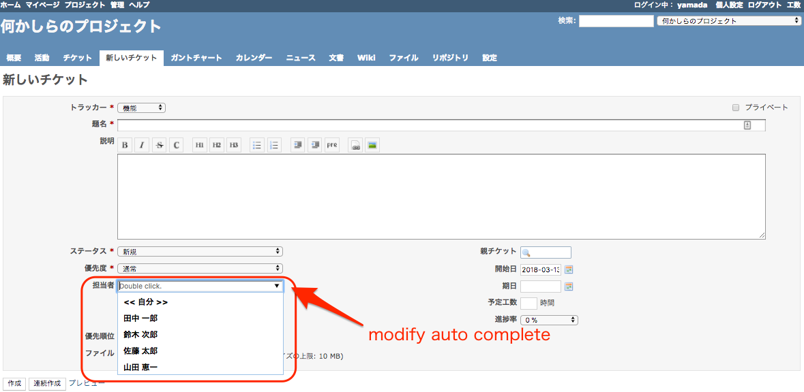

# Redmine Issue Assigned Auto Complete - Chrome Extension

Redmine Issue Assigned Auto Complete is Chrome Extension.

When you create or update Redmine's ticket, the contact's pull down will be changed to auto complete textbox.

